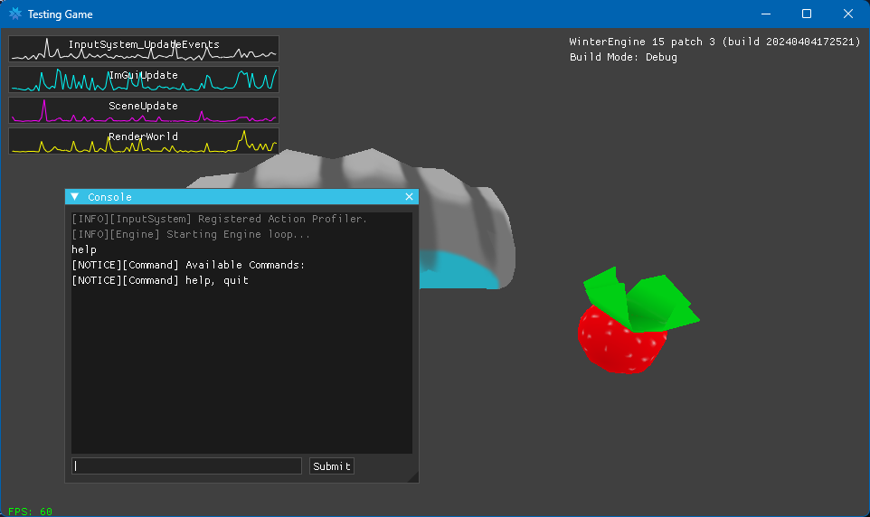

> [!NOTE]
> This is still extremely work in progress and extremely experimental! As more things are completed we will polish the code up, but right now there is one programmer on the project and the focus is making the engine work over everything else.

An open source, modular C# Game Engine built by Team Fennec.

Features Include:
- Modular design
- Custom Entity-Component System
- Game Module system
- Jolt Physics
- In-Engine tooling system
- Source-like Game Console

## Building
In order to build WinterEngine you'll need the following:
- Windows, Mac, or Linux
- .NET 7.0
- Git

## Development:
> [!NOTE]
> This section is not finished yet

In order to work with the Engine code effecively, the following setups are recommended for the specified platforms:
> [!NOTE]
> Neither macOS nor Linux are building at this time due to missing libvpkedit libraries

### Windows:
- Visual Studio 2022 or newer
- Windows 10 or newer

## Contribution
> [!NOTE]
> This will be replaced with a code of conduct file

# Acknowledgements
**Sources for logo:**
- https://commons.wikimedia.org/wiki/File:Nordic_Snowflake.svg
- Readex Pro (Font)

**Open Source Projects used:**
- Jolt Physics
- JoltSharp
- ImGui
- ImGuiNET
- Veldrid
- SDL2
- ValveKeyValue
- Datamodel.NET
- LibVPKEdit
- SharpGLTF

# Disclaimer
Team Fennec is not affiliated with, nor endorsed by, Valve Software. Source Engine is owned by Valve Software.
